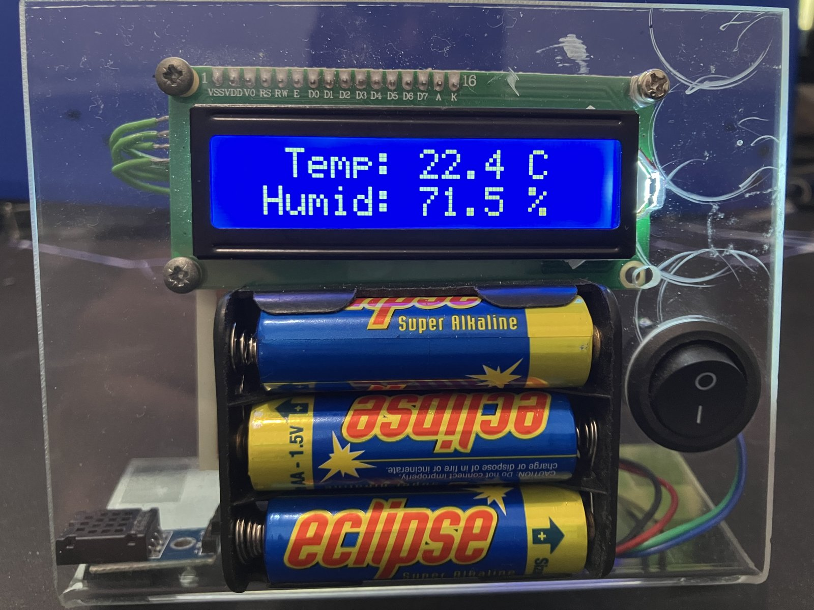
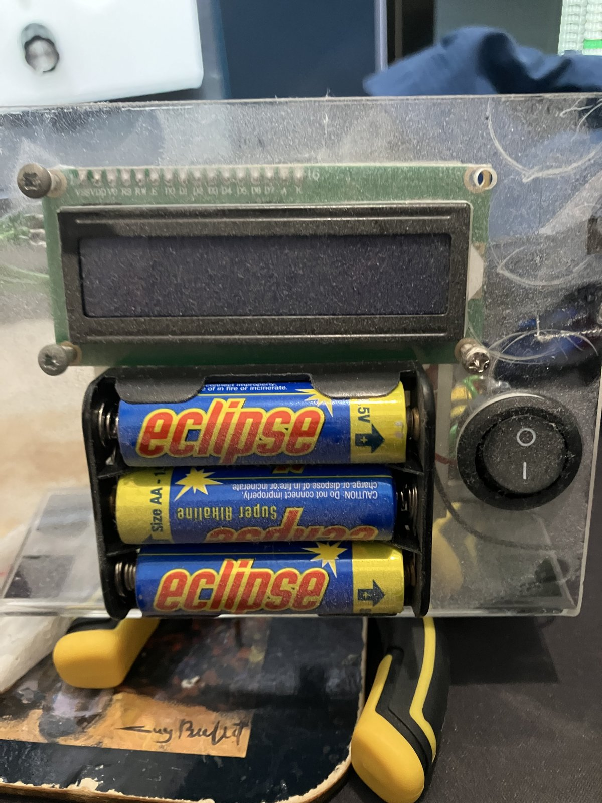
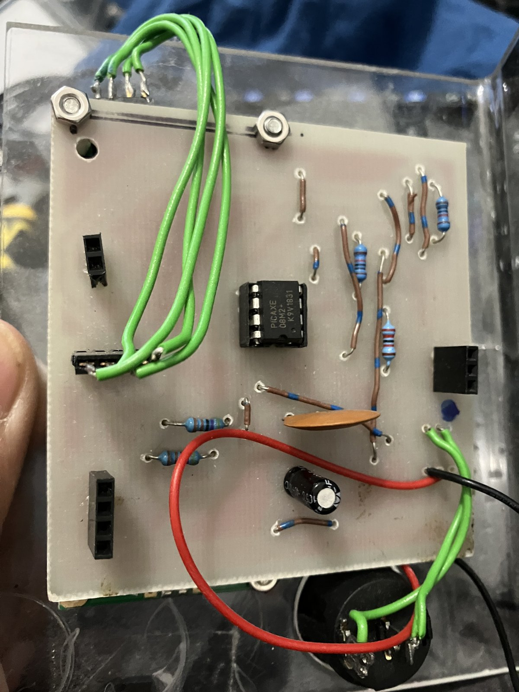
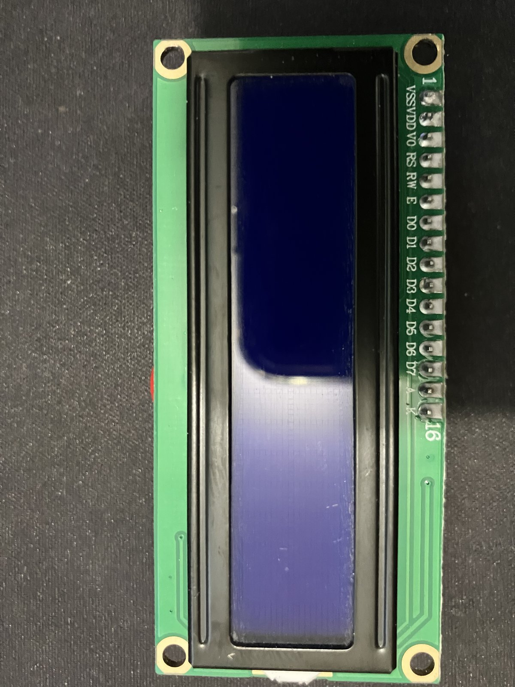
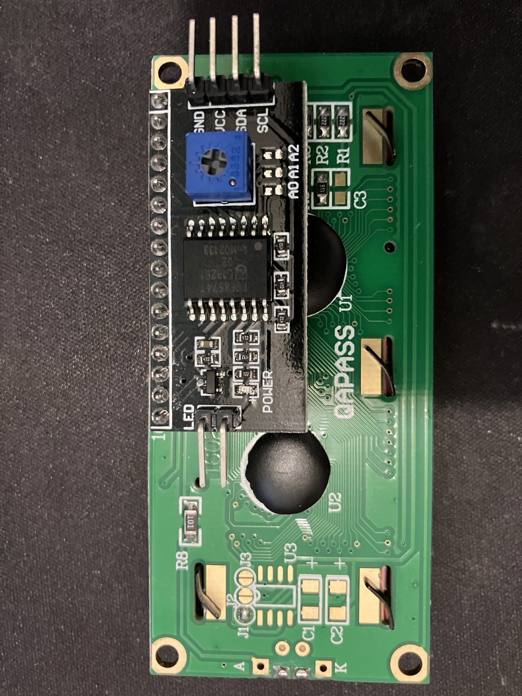
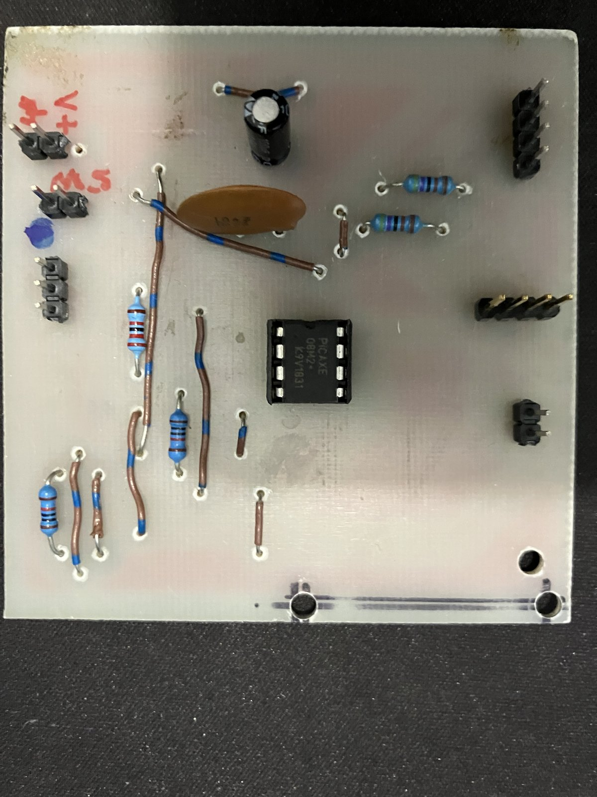
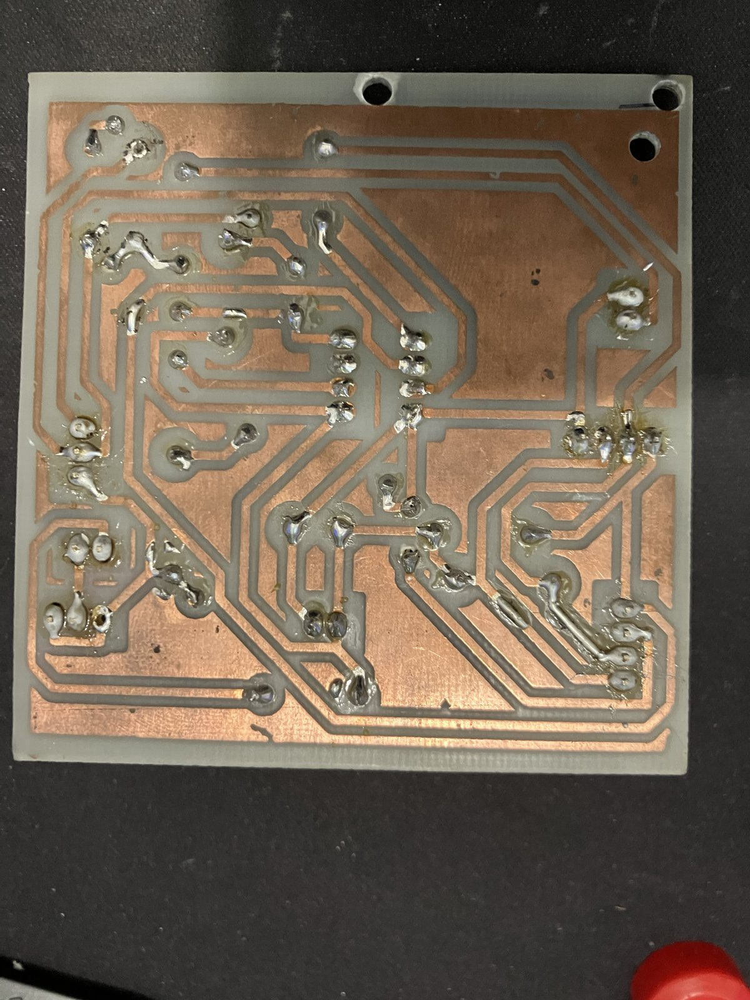
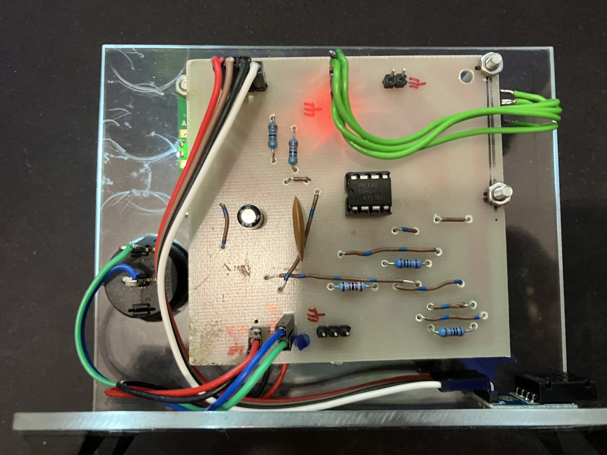
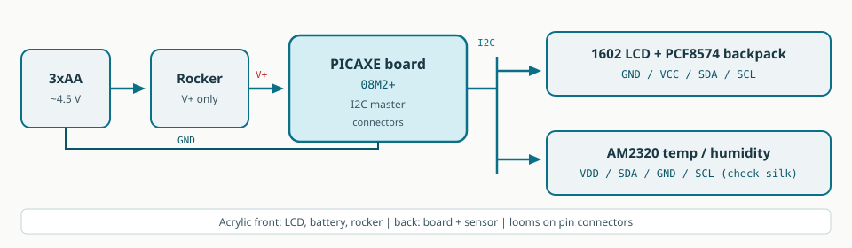

# PICAXE temp / humidity

<p class="lede">A gifted meter on acrylic — dusted off, connectors tidied, reading again.</p>

<figure class="hero">
  
  <figcaption>Front — Temp 22.4 °C, Humid 71.5 %</figcaption>
</figure>

## Story

Thank you to the young lady who gifted me this little meter. It had sat long enough to gather a soft grey coat of dust and lint — acrylic scratched, cells still in the holder, rocker left off. A kind handmade thing, and it deserved a cleanup rather than a drawer.

<div class="gallery">
  <figure>
    
    <figcaption>As received — dust on the LCD, pack, and rocker</figcaption>
  </figure>
  <figure>
    
    <figcaption>As received — PICAXE 08M2+, green jumpers hard-wired into the loom</figcaption>
  </figure>
</div>

I took it apart, wiped the acrylic, and lifted the modules so each piece could be cleaned and checked on its own.

## Cleanup

First the display — a QAPASS 1602 with a PCF8574 I2C backpack.

<div class="gallery">
  <figure>
    
    <figcaption>LCD front — 16×2, cleaned</figcaption>
  </figure>
  <figure>
    
    <figcaption>LCD back — PCF8574 (GND / VCC / SDA / SCL)</figcaption>
  </figure>
</div>

Then the hand-etched controller — PICAXE 08M2+ in a socket, passives, and headers for power, bus, and sensor.

<div class="gallery">
  <figure>
    
    <figcaption>Component side — PICAXE 08M2+</figcaption>
  </figure>
  <figure>
    
    <figcaption>Solder side — hand-etched copper</figcaption>
  </figure>
</div>

## Put back together

On the way back I improved the wiring: the old fixed jumpers gave way to pin connectors so the LCD, sensor, and power loom unplug cleanly — no more re-soldering just to lift a module. Routes were shortened and dressed so the acrylic sandwich opens without fighting the harness.

<figure>
  
  <figcaption>After tidy-up — connectors, power LED on, AM2320 on the corner</figcaption>
</figure>

Under the hood it is a small PICAXE 08M2+ talking I2C to the 1602 backpack and a four-pin temp/humidity sensor (AM2320-style: VDD / SDA / GND / SCL), running from 3×AA behind a rocker. This page stays light on firmware and focuses on the gifted build and the cleanup that brought it back.

## Block diagram

<figure class="schematic">
  
  <figcaption>3×AA → rocker → board → shared I2C → LCD + AM2320</figcaption>
</figure>

## Connections

Headers on the board feed power and a shared I2C bus — all on removable pin connectors after the tidy-up.

**Power** — switch only the positive lead:

```text
3×AA +  ──► rocker switch ──► board V+
3×AA −  ────────────────────► board GND
```

**LCD backpack** (4-pin header on the PCF8574):

```text
board GND ──► GND
board V+  ──► VCC
board SDA ──► SDA
board SCL ──► SCL
```

**AM2320** (common order — confirm silkscreen):

```text
board V+  ──► VDD
board SDA ──► SDA
board GND ──► GND
board SCL ──► SCL
```

The sensor pin order is easy to flip — match the module marking before powering. Headers stay removable so the panel, LCD, and sensor come apart without cutting wires.

## Quick test

1. AM2320 pin order matches the silkscreen (not assumed from memory).
2. Fresh 3×AA fitted; rocker off, then on — power LED and LCD backlight should wake.
3. Display settles to `Temp:` / `Humid:` with plausible numbers (not stuck zeros).
4. Rocker off cleanly; nothing should get hot.
